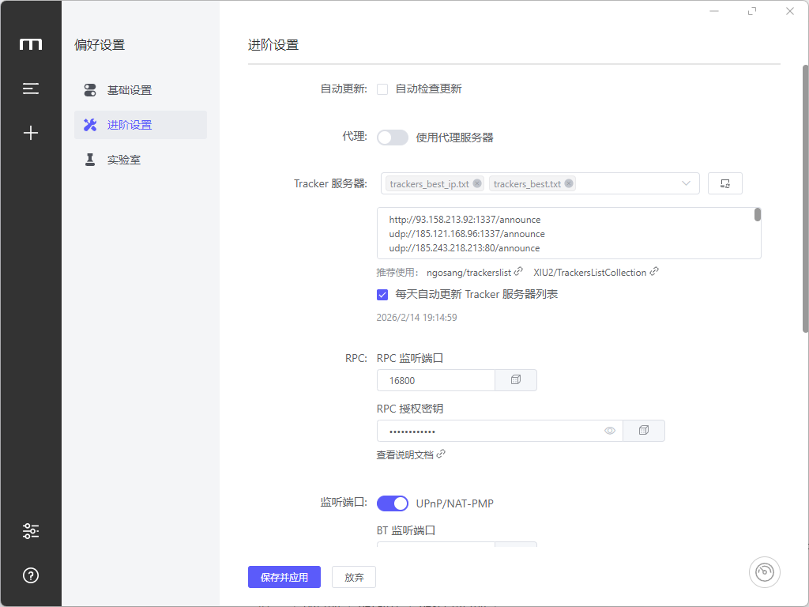

# Motrix WebExtension

适用于 **Chrome / Edge** 等 Chromium 浏览器的下载管理扩展，自动拦截浏览器下载并通过 aria2 JSON-RPC 发送到 [Motrix](https://motrix.app) 进行下载。

## 功能特性

- **自动拦截** — 捕获浏览器下载并转发至 Motrix
- **智能过滤** — 自动跳过 `blob:` / `data:` 链接，支持按文件扩展名和最小文件大小过滤
- **右键菜单** — 右键任意链接或图片，一键发送到 Motrix 下载
- **手动下载** — 在弹窗中直接粘贴 URL 发送到 Motrix
- **连接测试** — 一键检测 Motrix RPC 是否连通
- **开关控制** — 随时启用/禁用拦截，无需卸载扩展

## 安装方法

1. 克隆本仓库：
   ```bash
   git clone https://github.com/pansoul1/motrix-webextension.git
   ```
2. 打开浏览器扩展管理页面：
   - **Chrome：** `chrome://extensions`
   - **Edge：** `edge://extensions`
3. 开启 **开发者模式**
4. 点击 **加载已解压的扩展程序**，选择克隆下来的文件夹
5. 确保 [Motrix](https://motrix.app) 已启动（默认 RPC 端口：`16800`）

## 使用说明

点击扩展图标打开弹窗：

- **开关** — 启用/禁用下载拦截
- **RPC 设置** — 配置 RPC 地址和授权密钥
- **过滤设置** — 设置要拦截的文件扩展名（如 `zip,exe,dmg,iso`）和最小文件大小
- **手动下载** — 输入 URL 直接发送到 Motrix
- **测试连接** — 检查 Motrix 是否可连接

右键链接或图片，选择 **"使用 Motrix 下载此链接/图片"** 即可。

## 配置项

| 选项 | 默认值 | 说明 |
|------|--------|------|
| RPC 地址 | `http://localhost:16800/jsonrpc` | Motrix aria2 RPC 端点 |
| RPC 密钥 | *(空)* | RPC 授权密钥 |
| 文件扩展名 | *(空 = 拦截所有)* | 逗号分隔的扩展名列表 |
| 最小文件大小 | `0` | 最小文件大小（KB），0 表示不限 |

> **建议：** 请在 Motrix 的 **偏好设置 → 进阶设置** 中设置 RPC 授权密钥，并在扩展中填入相同的密钥，以确保安全性。



## 工作原理

1. 监听 `chrome.downloads.onCreated` 事件
2. 取消浏览器原生下载
3. 通过 `aria2.addUri` JSON-RPC 请求发送到 Motrix
4. 弹出通知提示下载成功或失败

## 环境要求

- **Chromium 内核浏览器**（Chrome、Edge、Brave 等）
- **[Motrix](https://motrix.app)** 已安装并运行

## 作者

由 [Pansoul](https://github.com/pansoul1) 开发

## 相关链接

- **GitHub：** [https://github.com/pansoul1/motrix-webextension](https://github.com/pansoul1/motrix-webextension)
- **Motrix 官网：** [https://motrix.app](https://motrix.app)

## 许可证

MIT
